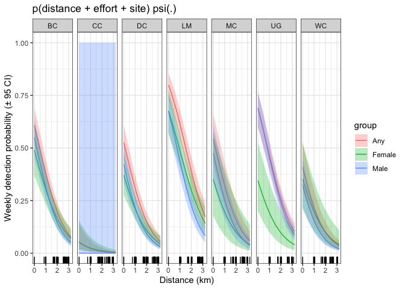
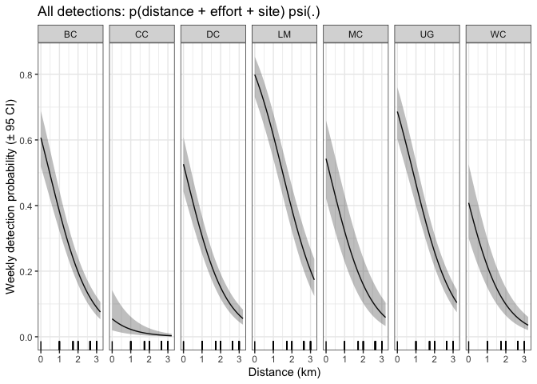

--------------------------------------------------------------------------------

### Occupancy models for analyzing spotted owl activity center ("big grid") data from 2021-2022


--------------------------------------------------------------------------------
## 
#### Load site-level covariate data


```
##     year_site site_name repro_state nested duration dist_actual
## 1: 2021_DC_01        DC     fledged      y      104    3018.404
## 2: 2021_DC_02        DC     fledged      y      104    2657.769
## 3: 2021_DC_03        DC     fledged      y      104    2605.506
## 4: 2021_DC_04        DC     fledged      y      104    3059.737
## 5: 2021_DC_05        DC     fledged      y      104    2643.332
## 6: 2021_DC_06        DC     fledged      y        7    2000.804
```

## 
#### Load observation-level covariate data


```
## [1] 136680.6
```

```
## [1] -61.15367
```

##
#### Load detection histories


```
##              V1 X1 X2 X3 X4 X5 X6 X7 X8 X9 X10 X11 X12 X13 X14 X15 X16 X17 X18
##   1: 2021_DC_01  0  0  0  0  0  0  0  0  0   0   0   0   0   0   0  NA  NA  NA
##   2: 2021_DC_02  0  0  0  0  0  0  0  0  0   0   0   0   0   0   0  NA  NA  NA
##   3: 2021_DC_03  0  0  0  0  0  0  0  0  0   0   0   0   0   0   0  NA  NA  NA
##   4: 2021_DC_04  0  0  0  0  0  0  0  0  0   0   0   0   0   0   0  NA  NA  NA
##   5: 2021_DC_05  0  0  0  0  0  0  0  0  0   0   0   0   0   0   0  NA  NA  NA
##  ---                                                                          
## 287: 2022_LM_33  0  0  0  0  0  0  0  0  0   1   1   0   1   0  NA  NA  NA  NA
## 288: 2022_LM_34  0  0  0  0  0  0  0  0  0   0   0   0   0   0  NA  NA  NA  NA
## 289: 2022_LM_35  0  0  0  0  0  0  0  0  0   0   0   0   0   0  NA  NA  NA  NA
## 290: 2022_LM_36  0  0  0  1  1  0  1  0  1   1   1   0   1   1  NA  NA  NA  NA
## 291: 2022_LM_37  0  0  0  1  1  0  1  0  0   1   1   0   1   1  NA  NA  NA  NA
##      X19 X20 X21
##   1:  NA  NA  NA
##   2:  NA  NA  NA
##   3:  NA  NA  NA
##   4:  NA  NA  NA
##   5:  NA  NA  NA
##  ---            
## 287:  NA  NA  NA
## 288:  NA  NA  NA
## 289:  NA  NA  NA
## 290:  NA  NA  NA
## 291:  NA  NA  NA
```

##
#### Create input files and view naive detections

<!-- --><!-- --><!-- --><!-- --><!-- --><!-- --><!-- -->

##
#### Run and compare models (constant psi)

##### - All detections

```
##                                 nPars     AIC  delta   AICwt cumltvWt
## p(dist + site + effort), psi(.)    10 2181.80   0.00 1.0e+00     1.00
## p(dist + site), psi(.)              9 2219.56  37.75 6.3e-09     1.00
## p(dist + effort), psi(.)            4 2304.32 122.51 2.5e-27     1.00
## p(dist + nest + effort), psi(.)     5 2306.31 124.50 9.2e-28     1.00
## p(dist), psi(.)                     3 2340.10 158.30 4.2e-35     1.00
## p(dist + nest), psi(.)              4 2342.08 160.27 1.6e-35     1.00
## p(effort), psi(.)                   3 2391.72 209.91 2.6e-46     1.00
## p(.), psi(.)}                       2 2424.98 243.18 1.6e-53     1.00
```

## 
##### - Female detections (any calls)

```
##                                 nPars     AIC delta   AICwt cumltvWt
## p(dist + site + effort), psi(.)    10 1275.22  0.00 9.9e-01     0.99
## p(dist + site), psi(.)              9 1284.00  8.79 1.2e-02     1.00
## p(dist + nest + effort), psi(.)     5 1333.53 58.31 2.2e-13     1.00
## p(dist + effort), psi(.)            4 1336.22 61.01 5.6e-14     1.00
## p(dist + nest), psi(.)              4 1341.88 66.66 3.3e-15     1.00
## p(dist), psi(.)                     3 1345.15 69.93 6.5e-16     1.00
## p(effort), psi(.)                   3 1345.94 70.73 4.3e-16     1.00
## p(.), psi(.)}                       2 1354.75 79.53 5.3e-18     1.00
```

## 
##### - Female detections (FNLC or pair)

```
##                                 nPars     AIC delta   AICwt cumltvWt
## p(dist + site + effort), psi(.)    10 1206.96  0.00 9.6e-01     0.96
## p(dist + site), psi(.)              9 1213.36  6.40 3.9e-02     1.00
## p(dist + nest + effort), psi(.)     5 1258.85 51.90 5.2e-12     1.00
## p(dist + nest), psi(.)              4 1265.00 58.04 2.4e-13     1.00
## p(dist), psi(.)                     3 1267.16 60.20 8.1e-14     1.00
## p(dist + effort), psi(.)            4 1274.49 67.54 2.1e-15     1.00
## p(effort), psi(.)                   3 1278.26 71.30 3.2e-16     1.00
## p(.), psi(.)}                       2 1284.86 77.90 1.2e-17     1.00
```

## 
##### - Female detections (FNLC only)

```
##                                 nPars     AIC delta   AICwt cumltvWt
## p(dist + site + effort), psi(.)    10 1201.31  0.00 9.6e-01     0.96
## p(dist + site), psi(.)              9 1207.46  6.16 4.4e-02     1.00
## p(dist + nest + effort), psi(.)     5 1253.80 52.49 3.8e-12     1.00
## p(dist + effort), psi(.)            4 1256.19 54.88 1.2e-12     1.00
## p(dist + nest), psi(.)              4 1259.65 58.35 2.0e-13     1.00
## p(dist), psi(.)                     3 1262.63 61.33 4.6e-14     1.00
## p(effort), psi(.)                   3 1274.13 72.82 1.5e-16     1.00
## p(.), psi(.)                        2 1280.48 79.18 6.1e-18     1.00
```

## 
##### - Male detections (any calls)

```
##                                 nPars     AIC delta   AICwt cumltvWt
## p(dist + site + effort), psi(.)    10 1206.96  0.00 9.6e-01     0.96
## p(dist + site), psi(.)              9 1213.36  6.40 3.9e-02     1.00
## p(dist + nest + effort), psi(.)     5 1258.85 51.90 5.2e-12     1.00
## p(dist + nest), psi(.)              4 1265.00 58.04 2.4e-13     1.00
## p(dist), psi(.)                     3 1267.16 60.20 8.1e-14     1.00
## p(dist + effort), psi(.)            4 1274.49 67.54 2.1e-15     1.00
## p(effort), psi(.)                   3 1278.26 71.30 3.2e-16     1.00
## p(.), psi(.)}                       2 1284.86 77.90 1.2e-17     1.00
```

## 
##### - Male detections (FNLC or pair)

```
##                                 nPars     AIC  delta   AICwt cumltvWt
## p(dist + site + effort), psi(.)    10 1873.65   0.00 1.0e+00     1.00
## p(dist + site), psi(.)              9 1903.69  30.04 3.0e-07     1.00
## p(dist + nest + effort), psi(.)     5 1939.70  66.06 4.5e-15     1.00
## p(dist + effort), psi(.)            4 1941.05  67.41 2.3e-15     1.00
## p(dist + nest), psi(.)              4 1967.58  93.93 4.0e-21     1.00
## p(dist), psi(.)                     3 1967.98  94.34 3.3e-21     1.00
## p(effort), psi(.)                   3 2032.67 159.02 2.9e-35     1.00
## p(.), psi(.)                        2 2058.05 184.41 9.0e-41     1.00
```

## 
##### - Male detections (FNLC only)

```
##                                 nPars     AIC  delta   AICwt cumltvWt
## p(dist + site + effort), psi(.)    10 1870.01   0.00 1.0e+00     1.00
## p(dist + site), psi(.)              9 1899.68  29.67 3.6e-07     1.00
## p(dist + nest + effort), psi(.)     5 1936.73  66.72 3.2e-15     1.00
## p(dist + effort), psi(.)            4 1938.45  68.45 1.4e-15     1.00
## p(dist + nest), psi(.)              4 1964.22  94.21 3.5e-21     1.00
## p(dist), psi(.)                     3 1964.95  94.94 2.4e-21     1.00
## p(effort), psi(.)                   3 2028.76 158.75 3.4e-35     1.00
## p(.), psi(.)                        2 2053.75 183.74 1.3e-40     1.00
```

## 
#### Compare parameter estimates from models with different call types (top models from above)

```
## 
## Call:
## occu(formula = ~scale(dist) + site + scale(effort) ~ 1, data = input_any)
## 
## Occupancy:
##  Estimate    SE     z P(>|z|)
##    -0.262 0.148 -1.77  0.0766
## 
## Detection:
##               Estimate     SE       z  P(>|z|)
## (Intercept)     -1.474 0.1337 -11.028 2.81e-28
## scale(dist)     -0.692 0.0645 -10.724 7.84e-27
## siteCC          -3.285 0.5460  -6.016 1.79e-09
## siteDC          -0.330 0.1845  -1.786 7.41e-02
## siteLM           0.946 0.1879   5.033 4.84e-07
## siteMC          -0.262 0.2759  -0.951 3.41e-01
## siteUG           0.350 0.1771   1.978 4.80e-02
## siteWC          -0.805 0.2587  -3.113 1.85e-03
## scale(effort)    0.518 0.1180   4.390 1.13e-05
## 
## AIC: 2181.804
```

```
## 
## Call:
## occu(formula = ~scale(dist) + site + scale(effort) ~ 1, data = input_female)
## 
## Occupancy:
##  Estimate    SE     z  P(>|z|)
##     -1.19 0.175 -6.78 1.21e-11
## 
## Detection:
##               Estimate     SE      z  P(>|z|)
## (Intercept)     -1.418 0.1831 -7.744 9.66e-15
## scale(dist)     -0.443 0.0996 -4.450 8.57e-06
## siteCC          -2.889 0.6486 -4.454 8.44e-06
## siteDC          -0.569 0.2405 -2.365 1.80e-02
## siteLM           0.773 0.2168  3.565 3.64e-04
## siteMC          -0.296 0.5870 -0.505 6.14e-01
## siteUG          -0.537 0.3960 -1.356 1.75e-01
## siteWC          -0.326 0.4363 -0.747 4.55e-01
## scale(effort)    0.266 0.0968  2.747 6.02e-03
## 
## AIC: 1275.219
```

```
## 
## Call:
## occu(formula = ~scale(dist) + site + scale(effort) ~ 1, data = input_female_fnlcp)
## 
## Occupancy:
##  Estimate  SE     z  P(>|z|)
##     -1.09 0.2 -5.47 4.41e-08
## 
## Detection:
##               Estimate     SE     z  P(>|z|)
## (Intercept)     -1.693 0.2006 -8.44 3.16e-17
## scale(dist)     -0.598 0.0999 -5.99 2.13e-09
## siteCC          -2.863 0.6456 -4.43 9.22e-06
## siteDC          -0.485 0.2473 -1.96 4.98e-02
## siteLM           0.783 0.2324  3.37 7.57e-04
## siteMC          -0.572 0.5473 -1.05 2.96e-01
## siteUG          -0.597 0.4348 -1.37 1.70e-01
## siteWC          -0.562 0.4269 -1.32 1.88e-01
## scale(effort)    0.236 0.0944  2.50 1.26e-02
## 
## AIC: 1206.959
```

```
## 
## Call:
## occu(formula = ~scale(dist) + site + scale(effort) ~ 1, data = input_female_fnlc)
## 
## Occupancy:
##  Estimate    SE    z  P(>|z|)
##     -1.05 0.203 -5.2 1.99e-07
## 
## Detection:
##               Estimate     SE     z  P(>|z|)
## (Intercept)     -1.746 0.2025 -8.62 6.65e-18
## scale(dist)     -0.620 0.0968 -6.40 1.51e-10
## siteCC          -2.857 0.6449 -4.43 9.40e-06
## siteDC          -0.464 0.2486 -1.87 6.22e-02
## siteLM           0.818 0.2345  3.49 4.84e-04
## siteMC          -0.800 0.5266 -1.52 1.29e-01
## siteUG          -0.600 0.4320 -1.39 1.65e-01
## siteWC          -0.568 0.4236 -1.34 1.80e-01
## scale(effort)    0.232 0.0939  2.47 1.34e-02
## 
## AIC: 1201.306
```

```
## 
## Call:
## occu(formula = ~scale(dist) + site + scale(effort) ~ 1, data = input_male)
## 
## Occupancy:
##  Estimate    SE     z P(>|z|)
##    -0.266 0.169 -1.57   0.117
## 
## Detection:
##               Estimate       SE        z  P(>|z|)
## (Intercept)    -1.8210   0.1484 -12.2685 1.34e-34
## scale(dist)    -0.7380   0.0731 -10.0968 5.71e-24
## siteCC        -14.5369 180.3273  -0.0806 9.36e-01
## siteDC         -0.4935   0.2117  -2.3311 1.97e-02
## siteLM          0.5380   0.2084   2.5813 9.84e-03
## siteMC         -0.0249   0.3054  -0.0815 9.35e-01
## siteUG          0.6050   0.1859   3.2555 1.13e-03
## siteWC         -0.8682   0.2866  -3.0295 2.45e-03
## scale(effort)   0.5210   0.1356   3.8418 1.22e-04
## 
## AIC: 1882.981
```

```
## 
## Call:
## occu(formula = ~scale(dist) + site + scale(effort) ~ 1, data = input_male_fnlcp)
## 
## Occupancy:
##  Estimate    SE     z P(>|z|)
##    -0.228 0.174 -1.31    0.19
## 
## Detection:
##               Estimate      SE       z  P(>|z|)
## (Intercept)     -1.822  0.1486 -12.266 1.38e-34
## scale(dist)     -0.739  0.0728 -10.156 3.12e-24
## siteCC          -8.901 10.6623  -0.835 4.04e-01
## siteDC          -0.500  0.2121  -2.356 1.85e-02
## siteLM           0.510  0.2090   2.440 1.47e-02
## siteMC          -0.310  0.3125  -0.992 3.21e-01
## siteUG           0.589  0.1862   3.161 1.57e-03
## siteWC          -0.936  0.2893  -3.235 1.22e-03
## scale(effort)    0.512  0.1349   3.796 1.47e-04
## 
## AIC: 1873.646
```

```
## 
## Call:
## occu(formula = ~scale(dist) + site + scale(effort) ~ 1, data = input_male_fnlc)
## 
## Occupancy:
##  Estimate    SE     z P(>|z|)
##    -0.225 0.175 -1.29   0.198
## 
## Detection:
##               Estimate      SE       z  P(>|z|)
## (Intercept)     -1.837  0.1491 -12.319 7.15e-35
## scale(dist)     -0.737  0.0729 -10.113 4.81e-24
## siteCC          -9.065 11.6697  -0.777 4.37e-01
## siteDC          -0.506  0.2129  -2.378 1.74e-02
## siteLM           0.529  0.2093   2.530 1.14e-02
## siteMC          -0.295  0.3130  -0.942 3.46e-01
## siteUG           0.606  0.1866   3.247 1.16e-03
## siteWC          -0.921  0.2897  -3.179 1.48e-03
## scale(effort)    0.507  0.1340   3.784 1.55e-04
## 
## AIC: 1870.007
```


##
#### Create marginal plots
<!-- --><!-- --><!-- -->


