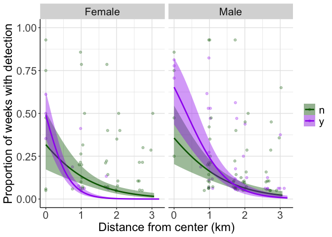

--------------------------------------------------------------------------------
#### Load data

```
##       year_site nested dist_actual survWeeks weeksAny weeksFemale weeksMale
##   1: 2021_DC_01      y    3018.404        15        0           0         0
##   2: 2021_DC_02      y    2657.769        15        0           0         0
##   3: 2021_DC_03      y    2605.506        15        0           0         0
##   4: 2021_DC_04      y    3059.737        15        0           0         0
##   5: 2021_DC_05      y    2643.332        15        0           0         0
##  ---                                                                       
## 287: 2022_LM_33      n    2643.504        14        3           3         0
## 288: 2022_LM_34      n    3009.265        14        0           0         0
## 289: 2022_LM_35      n    2666.787        14        0           0         0
## 290: 2022_LM_36      n    2731.669        14        8           3         4
## 291: 2022_LM_37      n    2970.722        14        7           4         5
```

### -- Models using the proportion of weeks with spotted owl detection as the response variable
#### 
#### 0. Binomial: weeks with detections ~ distance
####  


```
## 
## Call:
## glm(formula = cbind(weeksAny, survWeeks - weeksAny) ~ dist_actual, 
##     family = binomial(link = "logit"), data = ac_data)
## 
## Coefficients:
##               Estimate Std. Error z value Pr(>|z|)    
## (Intercept)  1.487e-01  1.100e-01   1.352    0.176    
## dist_actual -1.281e-03  6.392e-05 -20.045   <2e-16 ***
## ---
## Signif. codes:  0 '***' 0.001 '**' 0.01 '*' 0.05 '.' 0.1 ' ' 1
## 
## (Dispersion parameter for binomial family taken to be 1)
## 
##     Null deviance: 1741.9  on 290  degrees of freedom
## Residual deviance: 1288.0  on 289  degrees of freedom
## AIC: 1550.4
## 
## Number of Fisher Scoring iterations: 5
```
> deviance >> degrees of freedom, so use *quasibinomial*
      
####       
#### 1. Quasibinomial: weeks with detections ~ distance
####  
##### - Any detections

```
## 
## Call:
## glm(formula = cbind(weeksAny, survWeeks - weeksAny) ~ dist_actual, 
##     family = quasibinomial(link = "logit"), data = ac_data)
## 
## Coefficients:
##               Estimate Std. Error t value Pr(>|t|)    
## (Intercept)  0.1487410  0.2983256   0.499    0.618    
## dist_actual -0.0012813  0.0001734  -7.392 1.57e-12 ***
## ---
## Signif. codes:  0 '***' 0.001 '**' 0.01 '*' 0.05 '.' 0.1 ' ' 1
## 
## (Dispersion parameter for quasibinomial family taken to be 7.354602)
## 
##     Null deviance: 1741.9  on 290  degrees of freedom
## Residual deviance: 1288.0  on 289  degrees of freedom
## AIC: NA
## 
## Number of Fisher Scoring iterations: 5
```
#### 
##### - Females (FNLC/pair)

```
## 
## Call:
## glm(formula = cbind(weeksFemale, survWeeks - weeksFemale) ~ dist_actual, 
##     family = quasibinomial(link = "logit"), data = ac_data)
## 
## Coefficients:
##               Estimate Std. Error t value Pr(>|t|)    
## (Intercept) -0.6837060  0.3501626  -1.953   0.0518 .  
## dist_actual -0.0013648  0.0002249  -6.068 4.06e-09 ***
## ---
## Signif. codes:  0 '***' 0.001 '**' 0.01 '*' 0.05 '.' 0.1 ' ' 1
## 
## (Dispersion parameter for quasibinomial family taken to be 6.679863)
## 
##     Null deviance: 1053.2  on 290  degrees of freedom
## Residual deviance:  784.6  on 289  degrees of freedom
## AIC: NA
## 
## Number of Fisher Scoring iterations: 5
```
####
##### - Males (FNLC/pair)

```
## 
## Call:
## glm(formula = cbind(weeksMale, survWeeks - weeksMale) ~ dist_actual, 
##     family = quasibinomial(link = "logit"), data = ac_data)
## 
## Coefficients:
##               Estimate Std. Error t value Pr(>|t|)    
## (Intercept) -0.1484340  0.2981424  -0.498    0.619    
## dist_actual -0.0013002  0.0001791  -7.258 3.64e-12 ***
## ---
## Signif. codes:  0 '***' 0.001 '**' 0.01 '*' 0.05 '.' 0.1 ' ' 1
## 
## (Dispersion parameter for quasibinomial family taken to be 6.500964)
## 
##     Null deviance: 1426.3  on 290  degrees of freedom
## Residual deviance: 1045.1  on 289  degrees of freedom
## AIC: NA
## 
## Number of Fisher Scoring iterations: 5
```
  
#### Evaluate fit
<!-- --><!-- --><!-- -->

#### Plot:
  
<!-- --><!-- -->


####  
#### 2. Quasibinomial: weeks with detections ~ distance + nesting
#### 
##### (nesting is binary yes/no)
####  
##### - Any detections

```
## 
## Call:
## glm(formula = cbind(weeksAny, survWeeks - weeksAny) ~ dist_actual + 
##     nested, family = quasibinomial(link = "logit"), data = ac_data)
## 
## Coefficients:
##               Estimate Std. Error t value Pr(>|t|)    
## (Intercept)  0.1832726  0.3127092   0.586    0.558    
## dist_actual -0.0012809  0.0001724  -7.432 1.23e-12 ***
## nestedy     -0.0989355  0.2852860  -0.347    0.729    
## ---
## Signif. codes:  0 '***' 0.001 '**' 0.01 '*' 0.05 '.' 0.1 ' ' 1
## 
## (Dispersion parameter for quasibinomial family taken to be 7.265884)
## 
##     Null deviance: 1741.9  on 290  degrees of freedom
## Residual deviance: 1287.1  on 288  degrees of freedom
## AIC: NA
## 
## Number of Fisher Scoring iterations: 5
```
> no difference in 'nested' for all combined

####
##### - Females

```
## 
## Call:
## glm(formula = cbind(weeksFemale, survWeeks - weeksFemale) ~ dist_actual + 
##     nested, family = quasibinomial(link = "logit"), data = ac_data)
## 
## Coefficients:
##               Estimate Std. Error t value Pr(>|t|)    
## (Intercept) -0.3680639  0.3353086  -1.098   0.2733    
## dist_actual -0.0013834  0.0002056  -6.729 9.24e-11 ***
## nestedy     -1.0600753  0.4201846  -2.523   0.0122 *  
## ---
## Signif. codes:  0 '***' 0.001 '**' 0.01 '*' 0.05 '.' 0.1 ' ' 1
## 
## (Dispersion parameter for quasibinomial family taken to be 5.365711)
## 
##     Null deviance: 1053.25  on 290  degrees of freedom
## Residual deviance:  744.16  on 288  degrees of freedom
## AIC: NA
## 
## Number of Fisher Scoring iterations: 5
```
> significant difference between 'nested' and 'not nested' for females

####
##### - Males

```
## 
## Call:
## glm(formula = cbind(weeksMale, survWeeks - weeksMale) ~ dist_actual + 
##     nested, family = quasibinomial(link = "logit"), data = ac_data)
## 
## Coefficients:
##               Estimate Std. Error t value Pr(>|t|)    
## (Intercept) -0.2103713  0.3212961  -0.655    0.513    
## dist_actual -0.0013025  0.0001818  -7.164 6.58e-12 ***
## nestedy      0.1733685  0.2986662   0.580    0.562    
## ---
## Signif. codes:  0 '***' 0.001 '**' 0.01 '*' 0.05 '.' 0.1 ' ' 1
## 
## (Dispersion parameter for quasibinomial family taken to be 6.686196)
## 
##     Null deviance: 1426.3  on 290  degrees of freedom
## Residual deviance: 1042.8  on 288  degrees of freedom
## AIC: NA
## 
## Number of Fisher Scoring iterations: 5
```
> no difference in 'nested' for males


#### Plot

<!-- --><!-- --><!-- -->
